README
================
ojcharles
19/08/2022

\#odejunkfitr

A R package to assess whether your ode model is over-parameterised and
will fit any number of distributions.

In viral kinetic modelling often there are two competing ideas. 1 - I
care about uncovering specific mechanistic insights so my model should
represent the biology as accurately as possible. 2 - I can only measure
1 or two compartments, therefore my model should be as simple as
possible to allow me to measure the single key parameter I care about.

This package helps you understand with tangible outcomes where your
model lies on that spectrum. It does this by fitting against a number of
datasets from simple probability distributions to real published viral
kinetic data.

The package will also fit your data against several previously published
2, 3 and 4 compartment models that prioritised brevity and
identifieability of parameters.

install with:
`remotes::install_github("ojcharles/does_my_ode_model_fit_junk")`

## Core usage

    ## Warning: package 'nlmixr2' was built under R version 4.1.3

    ## Loading required package: nlmixr2data

    ## Warning: package 'nlmixr2data' was built under R version 4.1.3

    ## Warning: package 'xpose' was built under R version 4.1.3

    ## 
    ## Attaching package: 'xpose'

    ## The following object is masked from 'package:stats':
    ## 
    ##     filter

    ## 
    ## Attaching package: 'plotly'

    ## The following object is masked from 'package:ggplot2':
    ## 
    ##     last_plot

    ## The following object is masked from 'package:stats':
    ## 
    ##     filter

    ## The following object is masked from 'package:graphics':
    ## 
    ##     layout

    ## [1] ":)"

This package takes as input a nlmixr formatted model string.

    ## i parameter labels from comments are typically ignored in non-interactive mode

    ## i Need to run with the source intact to parse comments

    ## [1] "pass"

### fit model to nlmixr typical data

``` r
fit = nlmixr(ode_function, data1_theo_sd, list(print=0), est="saem")
```

    ## i parameter labels from comments are typically ignored in non-interactive mode

    ## i Need to run with the source intact to parse comments

    ## > loading into symengine environment...

    ## > pruning branches (`if`/`else`) of saem model...

    ## v done

    ## > finding duplicate expressions in saem model...

    ## [====|====|====|====|====|====|====|====|====|====] 0:00:00

    ## v done

    ## rxode2 2.0.7 using 4 threads (see ?getRxThreads)
    ##   no cache: create with `rxCreateCache()`

    ## Calculating covariance matrix

    ## > loading into symengine environment...

    ## > pruning branches (`if`/`else`) of saem model...

    ## v done

    ## > finding duplicate expressions in saem predOnly model 0...

    ## > finding duplicate expressions in saem predOnly model 1...

    ## > finding duplicate expressions in saem predOnly model 2...

    ## v done

    ## > Calculating residuals/tables

    ## v done

    ## > compress origData in nlmixr2 object, save 5952

    ## > compress phiM in nlmixr2 object, save 63664

    ## > compress parHist in nlmixr2 object, save 9544

    ## > compress saem0 in nlmixr2 object, save 26560

    ## Warning: package 'rxode2' was built under R version 4.1.3

``` r
print(paste0("fit AIC is:", fit$AIC))
```

    ## Calculating -2LL by Gaussian quadrature (nnodes=3,nsd=1.6)

    ## [1] "fit AIC is:379.379908736569"

### how well does my model fit spurious “junk”?

If the model is capable of fitting all of these trajectories, then you
should look in the mirror and contemplate.

#### At the population level

``` r
data_junk = read.csv("inst/junk.csv")
fit = nlmixr(ode_function, data_junk, list(print=0), est="saem")
```

    ## i parameter labels from comments are typically ignored in non-interactive mode

    ## i Need to run with the source intact to parse comments

    ## > loading into symengine environment...

    ## > pruning branches (`if`/`else`) of saem model...

    ## v done

    ## > finding duplicate expressions in saem model...

    ## v done

    ## Calculating covariance matrix

    ## > loading into symengine environment...

    ## > pruning branches (`if`/`else`) of saem model...

    ## v done

    ## > finding duplicate expressions in saem predOnly model 0...

    ## > finding duplicate expressions in saem predOnly model 1...

    ## > finding duplicate expressions in saem predOnly model 2...

    ## v done

    ## > Calculating residuals/tables

    ## v done

    ## > compress origData in nlmixr2 object, save 5744

    ## > compress phiM in nlmixr2 object, save 42600

    ## > compress parHist in nlmixr2 object, save 10648

    ## > compress saem0 in nlmixr2 object, save 25008

``` r
plot(fit)
```

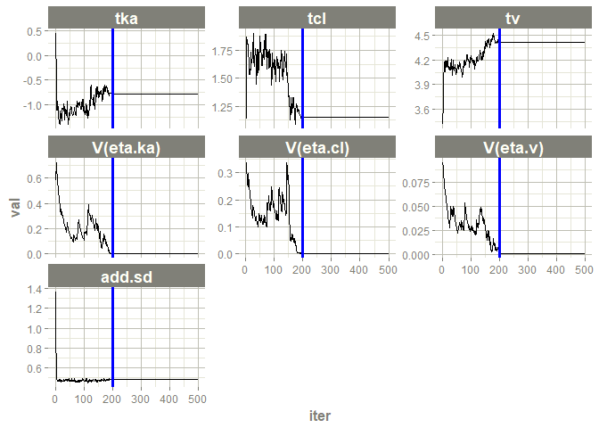<!-- -->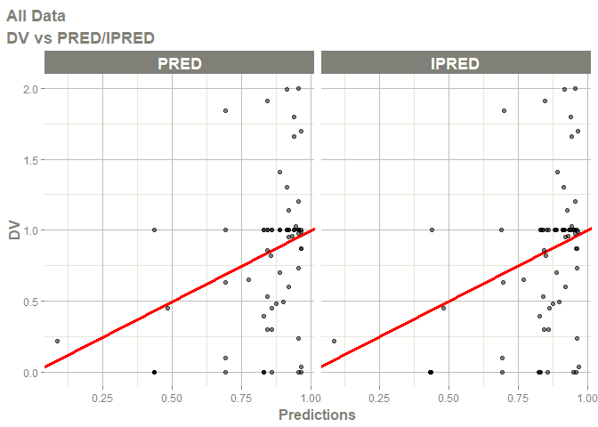<!-- -->

    ## Warning: Transformation introduced infinite values in continuous y-axis

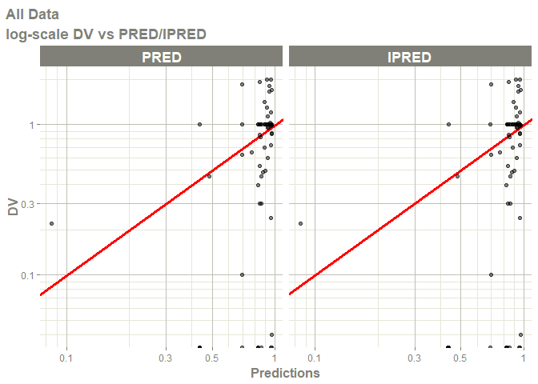<!-- -->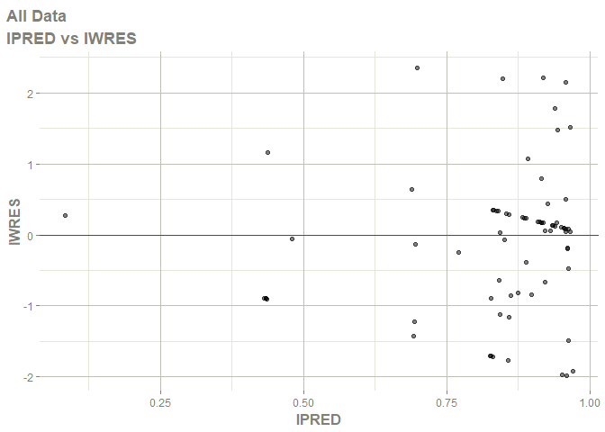<!-- -->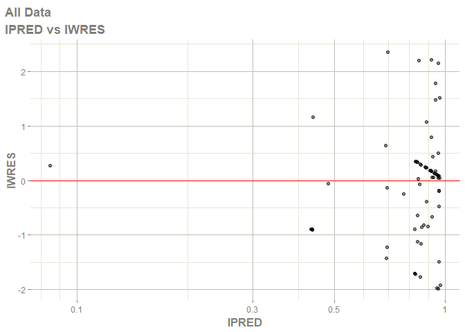<!-- --><!-- -->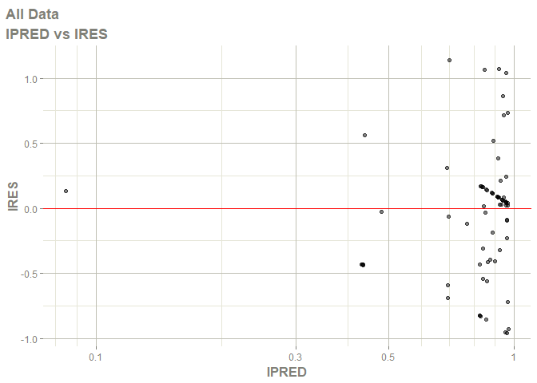<!-- --><!-- --><!-- -->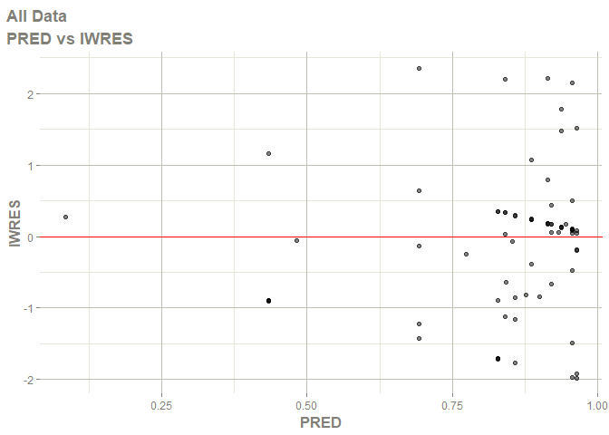<!-- -->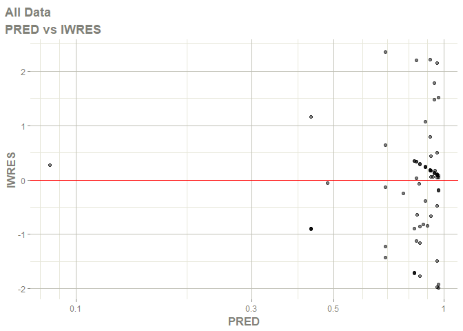<!-- -->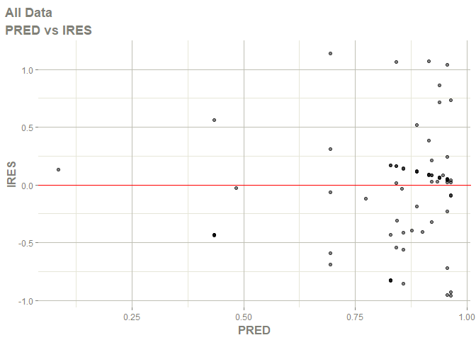<!-- --><!-- --><!-- -->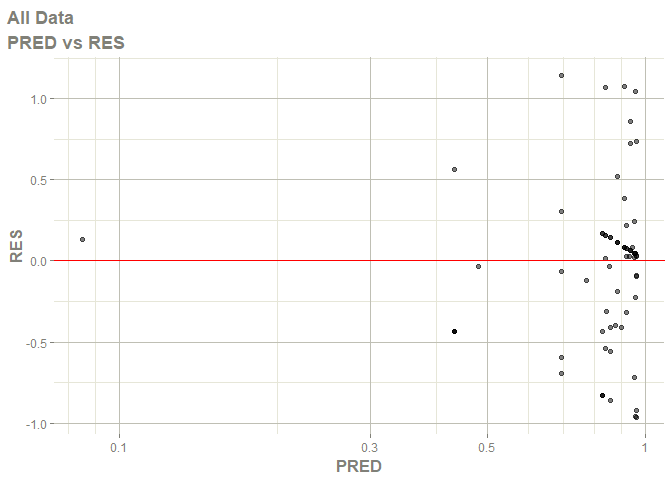<!-- -->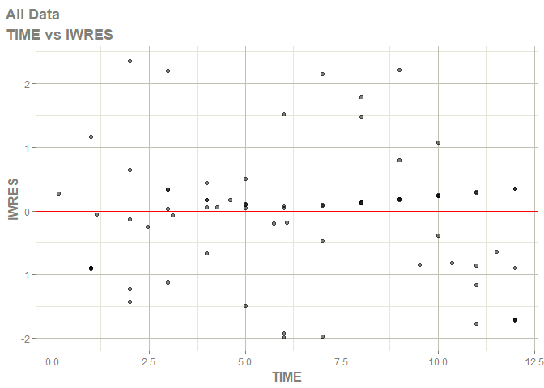<!-- -->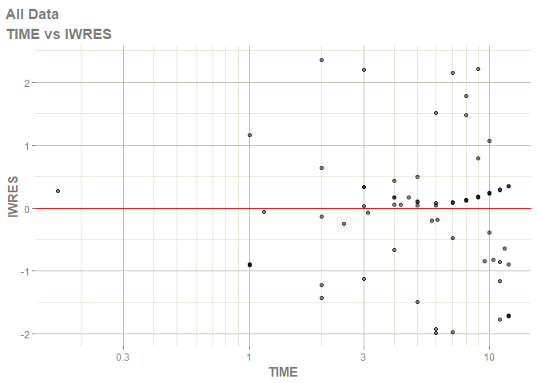<!-- -->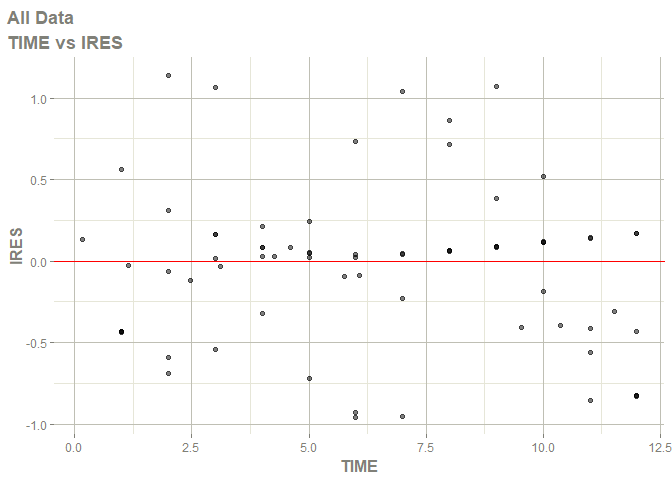<!-- --><!-- -->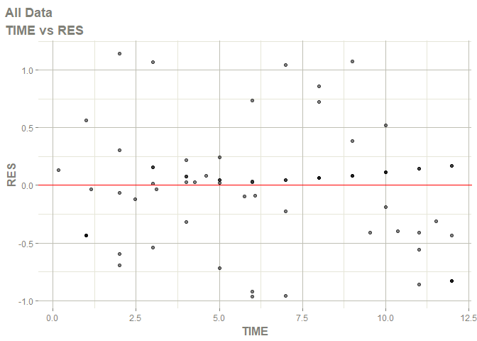<!-- -->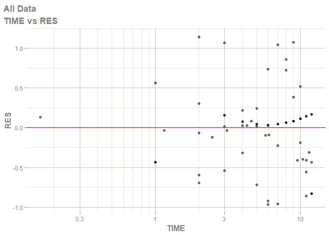<!-- -->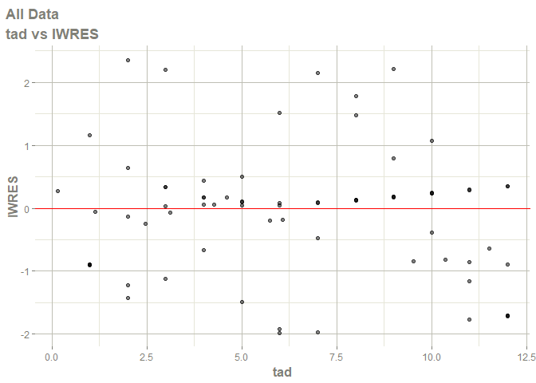<!-- -->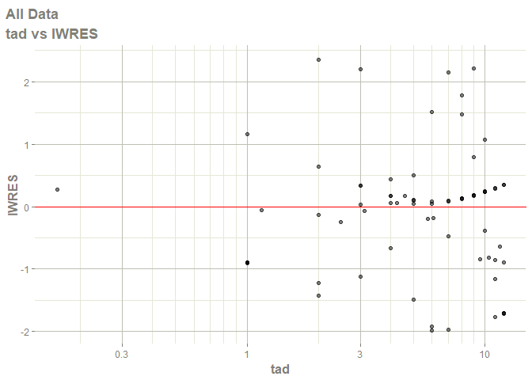<!-- -->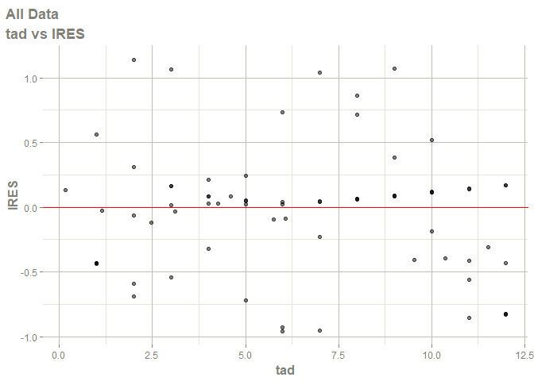<!-- -->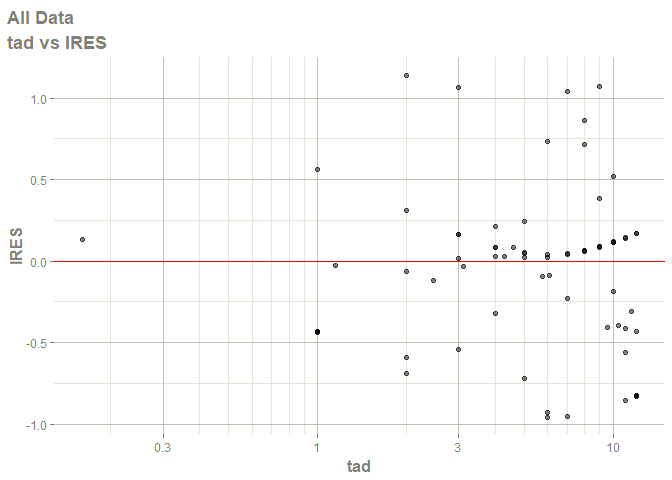<!-- -->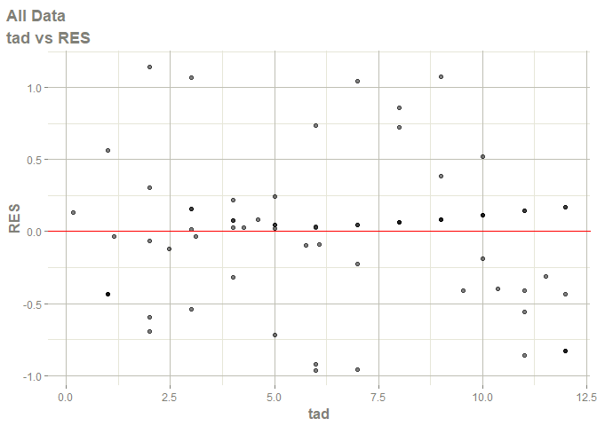<!-- -->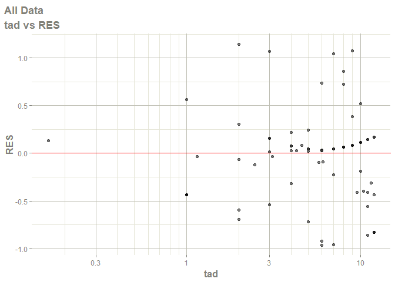<!-- -->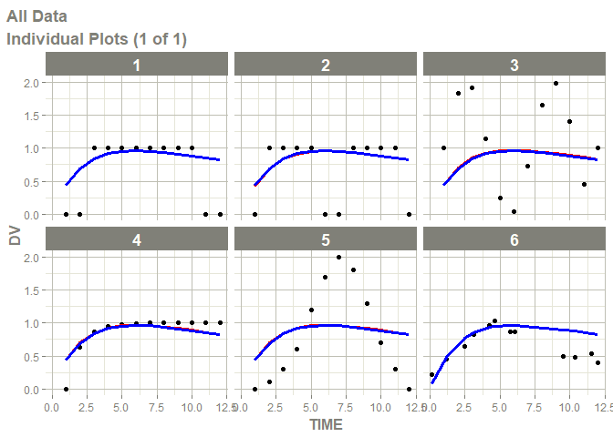<!-- -->

### visualise how well my model fits junk

``` r
all_fits = data.frame()
for(id in unique(data_junk$ID)){ # for each type of test data
  
  # spoof a population
  t = data_junk[data_junk$ID == id,]
  df2 = t
  for(i in 1:8){
    t1 = t
    t1$ID = i + 1
    t1$DV = t1$DV + rnorm(length(t1$DV), 0, 0.1)
    df2 = rbind(df2,t1)
  }
  
  # get fit
  fit = nlmixr(ode_function, df2, list(print=0), est="saem")
  fit$junk_id = id
  all_fits =  rbind(all_fits, fit)
}
```

    ## i parameter labels from comments are typically ignored in non-interactive mode

    ## i Need to run with the source intact to parse comments

    ## > loading into symengine environment...

    ## > pruning branches (`if`/`else`) of saem model...

    ## v done

    ## > finding duplicate expressions in saem model...

    ## v done

    ## Calculating covariance matrix

    ## > loading into symengine environment...

    ## > pruning branches (`if`/`else`) of saem model...

    ## v done

    ## > finding duplicate expressions in saem predOnly model 0...

    ## > finding duplicate expressions in saem predOnly model 1...

    ## > finding duplicate expressions in saem predOnly model 2...

    ## v done

    ## > Calculating residuals/tables

    ## v done

    ## > compress origData in nlmixr2 object, save 7400

    ## > compress phiM in nlmixr2 object, save 62864

    ## > compress parHist in nlmixr2 object, save 10216

    ## > compress saem0 in nlmixr2 object, save 28744

    ## i parameter labels from comments are typically ignored in non-interactive mode

    ## i Need to run with the source intact to parse comments

    ## > loading into symengine environment...

    ## > pruning branches (`if`/`else`) of saem model...

    ## v done

    ## > finding duplicate expressions in saem model...

    ## v done

    ## Calculating covariance matrix

    ## > loading into symengine environment...

    ## > pruning branches (`if`/`else`) of saem model...

    ## v done

    ## > finding duplicate expressions in saem predOnly model 0...

    ## > finding duplicate expressions in saem predOnly model 1...

    ## > finding duplicate expressions in saem predOnly model 2...

    ## v done

    ## > Calculating residuals/tables

    ## v done

    ## > compress origData in nlmixr2 object, save 14544

    ## > compress phiM in nlmixr2 object, save 44064

    ## > compress parHist in nlmixr2 object, save 10384

    ## > compress saem0 in nlmixr2 object, save 28480

    ## i parameter labels from comments are typically ignored in non-interactive mode

    ## i Need to run with the source intact to parse comments

    ## > loading into symengine environment...

    ## > pruning branches (`if`/`else`) of saem model...

    ## v done

    ## > finding duplicate expressions in saem model...

    ## v done

    ## Calculating covariance matrix

    ## > loading into symengine environment...

    ## > pruning branches (`if`/`else`) of saem model...

    ## v done

    ## > finding duplicate expressions in saem predOnly model 0...

    ## > finding duplicate expressions in saem predOnly model 1...

    ## > finding duplicate expressions in saem predOnly model 2...

    ## v done

    ## > Calculating residuals/tables

    ## v done

    ## > compress origData in nlmixr2 object, save 14464

    ## > compress phiM in nlmixr2 object, save 44192

    ## > compress parHist in nlmixr2 object, save 10240

    ## > compress saem0 in nlmixr2 object, save 28416

    ## i parameter labels from comments are typically ignored in non-interactive mode

    ## i Need to run with the source intact to parse comments

    ## > loading into symengine environment...

    ## > pruning branches (`if`/`else`) of saem model...

    ## v done

    ## > finding duplicate expressions in saem model...

    ## v done

    ## Calculating covariance matrix

    ## > loading into symengine environment...

    ## > pruning branches (`if`/`else`) of saem model...

    ## v done

    ## > finding duplicate expressions in saem predOnly model 0...

    ## > finding duplicate expressions in saem predOnly model 1...

    ## > finding duplicate expressions in saem predOnly model 2...

    ## v done

    ## > Calculating residuals/tables

    ## v done

    ## > compress origData in nlmixr2 object, save 14504

    ## > compress phiM in nlmixr2 object, save 46592

    ## > compress parHist in nlmixr2 object, save 10712

    ## > compress saem0 in nlmixr2 object, save 28872

    ## i parameter labels from comments are typically ignored in non-interactive mode

    ## i Need to run with the source intact to parse comments

    ## > loading into symengine environment...

    ## > pruning branches (`if`/`else`) of saem model...

    ## v done

    ## > finding duplicate expressions in saem model...

    ## v done

    ## Calculating covariance matrix

    ## > loading into symengine environment...

    ## > pruning branches (`if`/`else`) of saem model...

    ## v done

    ## > finding duplicate expressions in saem predOnly model 0...

    ## > finding duplicate expressions in saem predOnly model 1...

    ## > finding duplicate expressions in saem predOnly model 2...

    ## v done

    ## > Calculating residuals/tables

    ## v done

    ## > compress origData in nlmixr2 object, save 14496

    ## > compress phiM in nlmixr2 object, save 45480

    ## > compress parHist in nlmixr2 object, save 10672

    ## > compress saem0 in nlmixr2 object, save 28776

    ## i parameter labels from comments are typically ignored in non-interactive mode

    ## i Need to run with the source intact to parse comments

    ## > loading into symengine environment...

    ## > pruning branches (`if`/`else`) of saem model...

    ## v done

    ## > finding duplicate expressions in saem model...

    ## v done

    ## Calculating covariance matrix

    ## > loading into symengine environment...

    ## > pruning branches (`if`/`else`) of saem model...

    ## v done

    ## > finding duplicate expressions in saem predOnly model 0...

    ## > finding duplicate expressions in saem predOnly model 1...

    ## > finding duplicate expressions in saem predOnly model 2...

    ## v done

    ## > Calculating residuals/tables

    ## v done

    ## > compress origData in nlmixr2 object, save 14384

    ## > compress phiM in nlmixr2 object, save 45832

    ## > compress parHist in nlmixr2 object, save 11112

    ## > compress saem0 in nlmixr2 object, save 28832

``` r
  # plot
ggplot(all_fits) +
  geom_point(aes(x = TIME , y = DV)) +
  geom_line(aes(x = TIME, y = IPRED, colour = ID)) +
  theme_classic() +
  labs(subtitle = "Fit of your model to spurious trajectories, per trajectory fit",
       colour = "simulated individual") +
  facet_wrap(~junk_id, scales = "free")
```

<!-- -->

ahh but the dynamics i care about are much faster / shorter! Well then
alter the junk data, they’re all nicely scaled :)

``` r
data_junk$TIME = data_junk$TIME * 5 # 2 months now
all_fits = data.frame()
for(id in unique(data_junk$ID)){ # for each type of test data
  
  # spoof a population
  t = data_junk[data_junk$ID == id,]
  df2 = t
  for(i in 1:8){
    t1 = t
    t1$ID = i + 1
    t1$DV = t1$DV + rnorm(length(t1$DV), 0, 0.1)
    df2 = rbind(df2,t1)
  }
  
  # get fit
  fit = nlmixr(ode_function, df2, list(print=0), est="saem")
  fit$junk_id = id
  all_fits =  rbind(all_fits, fit)
}
```

    ## i parameter labels from comments are typically ignored in non-interactive mode

    ## i Need to run with the source intact to parse comments

    ## > loading into symengine environment...

    ## > pruning branches (`if`/`else`) of saem model...

    ## v done

    ## > finding duplicate expressions in saem model...

    ## v done

    ## Calculating covariance matrix

    ## > loading into symengine environment...

    ## > pruning branches (`if`/`else`) of saem model...

    ## v done

    ## > finding duplicate expressions in saem predOnly model 0...

    ## > finding duplicate expressions in saem predOnly model 1...

    ## > finding duplicate expressions in saem predOnly model 2...

    ## v done

    ## > Calculating residuals/tables

    ## v done

    ## > compress origData in nlmixr2 object, save 7392

    ## > compress phiM in nlmixr2 object, save 62768

    ## > compress parHist in nlmixr2 object, save 10224

    ## > compress saem0 in nlmixr2 object, save 28608

    ## i parameter labels from comments are typically ignored in non-interactive mode

    ## i Need to run with the source intact to parse comments

    ## > loading into symengine environment...

    ## > pruning branches (`if`/`else`) of saem model...

    ## v done

    ## > finding duplicate expressions in saem model...

    ## v done

    ## Calculating covariance matrix

    ## > loading into symengine environment...

    ## > pruning branches (`if`/`else`) of saem model...

    ## v done

    ## > finding duplicate expressions in saem predOnly model 0...

    ## > finding duplicate expressions in saem predOnly model 1...

    ## > finding duplicate expressions in saem predOnly model 2...

    ## v done

    ## > Calculating residuals/tables

    ## v done

    ## > compress origData in nlmixr2 object, save 14536

    ## > compress phiM in nlmixr2 object, save 43264

    ## > compress parHist in nlmixr2 object, save 10376

    ## > compress saem0 in nlmixr2 object, save 28568

    ## i parameter labels from comments are typically ignored in non-interactive mode

    ## i Need to run with the source intact to parse comments

    ## > loading into symengine environment...

    ## > pruning branches (`if`/`else`) of saem model...

    ## v done

    ## > finding duplicate expressions in saem model...

    ## v done

    ## Calculating covariance matrix

    ## > loading into symengine environment...

    ## > pruning branches (`if`/`else`) of saem model...

    ## v done

    ## > finding duplicate expressions in saem predOnly model 0...

    ## > finding duplicate expressions in saem predOnly model 1...

    ## > finding duplicate expressions in saem predOnly model 2...

    ## v done

    ## > Calculating residuals/tables

    ## v done

    ## > compress origData in nlmixr2 object, save 14472

    ## > compress phiM in nlmixr2 object, save 41784

    ## > compress parHist in nlmixr2 object, save 10112

    ## > compress saem0 in nlmixr2 object, save 28272

    ## i parameter labels from comments are typically ignored in non-interactive mode

    ## i Need to run with the source intact to parse comments

    ## > loading into symengine environment...

    ## > pruning branches (`if`/`else`) of saem model...

    ## v done

    ## > finding duplicate expressions in saem model...

    ## v done

    ## Calculating covariance matrix

    ## > loading into symengine environment...

    ## > pruning branches (`if`/`else`) of saem model...

    ## v done

    ## > finding duplicate expressions in saem predOnly model 0...

    ## > finding duplicate expressions in saem predOnly model 1...

    ## > finding duplicate expressions in saem predOnly model 2...

    ## v done

    ## > Calculating residuals/tables

    ## v done

    ## > compress origData in nlmixr2 object, save 14504

    ## > compress phiM in nlmixr2 object, save 47328

    ## > compress parHist in nlmixr2 object, save 10608

    ## > compress saem0 in nlmixr2 object, save 28768

    ## i parameter labels from comments are typically ignored in non-interactive mode

    ## i Need to run with the source intact to parse comments

    ## > loading into symengine environment...

    ## > pruning branches (`if`/`else`) of saem model...

    ## v done

    ## > finding duplicate expressions in saem model...

    ## v done

    ## Calculating covariance matrix

    ## > loading into symengine environment...

    ## > pruning branches (`if`/`else`) of saem model...

    ## v done

    ## > finding duplicate expressions in saem predOnly model 0...

    ## > finding duplicate expressions in saem predOnly model 1...

    ## > finding duplicate expressions in saem predOnly model 2...

    ## v done

    ## > Calculating residuals/tables

    ## v done

    ## > compress origData in nlmixr2 object, save 14488

    ## > compress phiM in nlmixr2 object, save 46600

    ## > compress parHist in nlmixr2 object, save 10568

    ## > compress saem0 in nlmixr2 object, save 28696

    ## i parameter labels from comments are typically ignored in non-interactive mode

    ## i Need to run with the source intact to parse comments

    ## > loading into symengine environment...

    ## > pruning branches (`if`/`else`) of saem model...

    ## v done

    ## > finding duplicate expressions in saem model...

    ## v done

    ## Calculating covariance matrix

    ## > loading into symengine environment...

    ## > pruning branches (`if`/`else`) of saem model...

    ## v done

    ## > finding duplicate expressions in saem predOnly model 0...

    ## > finding duplicate expressions in saem predOnly model 1...

    ## > finding duplicate expressions in saem predOnly model 2...

    ## v done

    ## > Calculating residuals/tables

    ## v done

    ## > compress origData in nlmixr2 object, save 14440

    ## > compress phiM in nlmixr2 object, save 47824

    ## > compress parHist in nlmixr2 object, save 10544

    ## > compress saem0 in nlmixr2 object, save 28560

``` r
  # plot
ggplot(all_fits) +
  geom_point(aes(x = TIME , y = DV)) +
  geom_line(aes(x = TIME, y = IPRED, colour = ID)) +
  theme_classic() +
  labs(subtitle = "Fit of your model to spurious trajectories, per trajectory fit",
       colour = "simulated individual") +
  facet_wrap(~junk_id, scales = "free") 
```

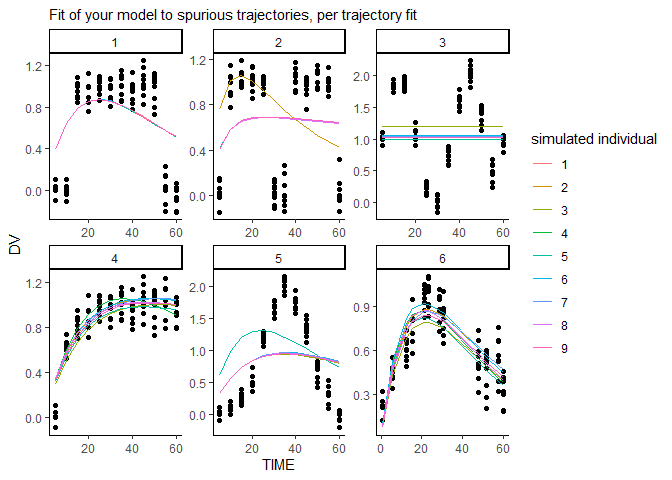<!-- -->

#### how can I rectify this?

well why not try a simpler model?

The below chunk is compute intensive and is skipped in this example,
it’s outcomes have been precomputed and are shown below.

``` r
# load model building functions
source(system.file("viral_models.r", package = "odejunkfitr"))

# load the modelling options to run
model_handler = read.csv(system.file("all_vk_models.csv", package = "odejunkfitr"))
model_handler$shortname = ""

model_handler$AIC =0
for(i in 1:nrow(model_handler)){
  # slightly verbose here as we want to scale
  #model_name = "SMEIMCs9"
  model_name = model_handler[i,1]
  model_handler$shortname[i] = paste0(model_handler[i,2:6],collapse = "")
  
  model_function = get(model_name)
  model_string = model_function(model_handler[i,2],
                                model_handler[i,3],
                                model_handler[i,4],
                                model_handler[i,5],
                                model_handler[i,6])
  ode_function = ode_string_to_function(model_string)
  fit = suppressWarnings(suppressMessages(
    nlmixr(ode_function,
               data2_cmv_untreated,
               list(print=0), est="saem")
  ))
  #print(paste0("AIC:", fit$AIC, " - Model:", model_name, " - Fixed vector:", paste0(model_handler[i,2:6],collapse = "")))
  model_handler$AIC[i] = round(fit$AIC,2)
}
rm("fit")
```

``` r
# precomputed AIC comparison
df = read.csv(system.file("all_vk_models_precomputed.csv", package = "odejunkfitr"))
df
```

    ##    model_name  arg1 arg2 arg3 arg4 arg5 shortname     AIC
    ## 1    SMEIMCs9  TRUE    1    1    1    1  TRUE1111  342.84
    ## 2    SMEIMCs9 FALSE    1    1    1    1 FALSE1111  348.35
    ## 3    SMEIMCs8  TRUE    1    1    1    1  TRUE1111  342.99
    ## 4    SMEIMCs8 FALSE    1    1    1    1 FALSE1111  356.38
    ## 5    SMEIMCs7 FALSE    F    1    1    1 FALSEF111  434.85
    ## 6    SMEIMCs7  TRUE    F    1    1    1  TRUEF111  464.31
    ## 7    SMEIMCs7 FALSE    T    1    1    1 FALSET111  418.79
    ## 8    SMEIMCs7  TRUE    T    1    1    1  TRUET111  397.76
    ## 9   EDICwTCL6 FALSE    F    F    F    1 FALSEFFF1  385.31
    ## 10  EDICwTCL6 FALSE    F    T    T    1 FALSEFTT1  354.18
    ## 11  EDICwTCL6  TRUE    T    F    F    1  TRUETFF1  379.75
    ## 12  EDICwTCL6  TRUE    T    T    T    1  TRUETTT1  364.36
    ## 13  EDICwTCL5 FALSE    F    1    1    1 FALSEF111 1148.52
    ## 14  EDICwTCL5 FALSE    T    1    1    1 FALSET111  497.80
    ## 15  EDICwTCL5  TRUE    F    1    1    1  TRUEF111  687.56
    ## 16  EDICwTCL5  TRUE    T    1    1    1  TRUET111  477.24
    ## 17  EDICwTCL4 FALSE    F    1    1    1 FALSEF111  514.20
    ## 18  EDICwTCL4 FALSE    T    1    1    1 FALSET111  505.48
    ## 19  EDICwTCL4  TRUE    F    1    1    1  TRUEF111  515.20
    ## 20  EDICwTCL4  TRUE    T    1    1    1  TRUET111  743.32
    ## 21  EDICwTCL3 FALSE    F    F    1    1 FALSEFF11     Inf
    ## 22  EDICwTCL3  TRUE    F    F    1    1  TRUEFF11  487.34
    ## 23  EDICwTCL3  TRUE    T    F    1    1  TRUETF11  414.25
    ## 24  EDICwTCL3  TRUE    T    T    1    1  TRUETT11  380.05
