README
================
ojcharles
19/08/2022

\#odejunkfitr

A R package to assess whether your ode model is over-parameterised and
will fit any number of distributions.

In viral kinetic modelling often there are two competing ideas. 1 - I
care about uncovering specific mechanistic insights so my model should
represent the biology as accurately as possible. 2 - I can only measure
1 or two compartments, therefore my model should be as simple as
possible to allow me to measure the single key parameter I care about.

This package helps you understand with tangible outcomes where your
model lies on that spectrum. It does this by fitting against a number of
datasets from simple probability distributions to real published viral
kinetic data.

install with:
`remotes::install_github("ojcharles/does_my_ode_model_fit_junk")`

## Core usage

    ## Warning: package 'xpose' was built under R version 4.1.3

    ## 
    ## Attaching package: 'xpose'

    ## The following object is masked from 'package:nlmixr':
    ## 
    ##     vpc

    ## The following object is masked from 'package:stats':
    ## 
    ##     filter

    ## Warning: package 'xpose.nlmixr' was built under R version 4.1.3

    ## 
    ## Attaching package: 'xpose.nlmixr'

    ## The following object is masked from 'package:xpose':
    ## 
    ##     vpc

    ## 
    ## Attaching package: 'plotly'

    ## The following object is masked from 'package:ggplot2':
    ## 
    ##     last_plot

    ## The following object is masked from 'package:stats':
    ## 
    ##     filter

    ## The following object is masked from 'package:graphics':
    ## 
    ##     layout

    ## [1] ":)"

This package takes as input a nlmixr formatted model string.

    ## i parameter labels from comments are typically ignored in non-interactive mode

    ## i Need to run with the source intact to parse comments

    ## [1] "pass"

## fit model to nlmixr typical data

``` r
fit = nlmixr(ode_function, data1_theo_sd, list(print=0), est="saem") # works
```

    ## i parameter labels from comments are typically ignored in non-interactive mode

    ## i Need to run with the source intact to parse comments

    ## > generate SAEM model

    ## v done

    ## RxODE 1.1.4 using 4 threads (see ?getRxThreads)
    ##   no cache: create with `rxCreateCache()`

    ## Calculating covariance matrix

    ## > creating full model...

    ## > pruning branches (`if`/`else`)...

    ## v done

    ## > loading into symengine environment...

    ## v done

    ## > compiling EBE model...

    ## v done

    ## Calculating residuals/tables

    ## done

    ## Warning in (function (uif, data, est = NULL, control = list(), ..., sum.prod =
    ## FALSE, : Bounds are ignored in SAEM

``` r
print(paste0("fit AIC is:", fit$AIC))
```

    ## Calculating -2LL by Gaussian quadrature (nnodes=3,nsd=1.6)

    ## 
    ## [1] "fit AIC is:379.37990873657"

## fit model to lots of spurious data “junk”

this will throw more warnings that a typical fit, and will take longer
as this data is so “whack”.

``` r
data_junk = read.csv("inst/junk.csv")
fit = nlmixr(ode_function, data_junk, list(print=0), est="saem") # works
```

    ## i parameter labels from comments are typically ignored in non-interactive mode

    ## i Need to run with the source intact to parse comments

    ## > generate SAEM model

    ## v done

    ## Calculating covariance matrix

    ## Calculating residuals/tables

    ## done

    ## Warning in (function (uif, data, est = NULL, control = list(), ..., sum.prod =
    ## FALSE, : Bounds are ignored in SAEM

``` r
print(paste0("fit AIC is:", fit$AIC))
```

    ## Calculating -2LL by Gaussian quadrature (nnodes=3,nsd=1.6)

    ## 
    ## [1] "fit AIC is:329.828472013525"

## visualise how well my model fits junk

``` r
plot(fit)
```

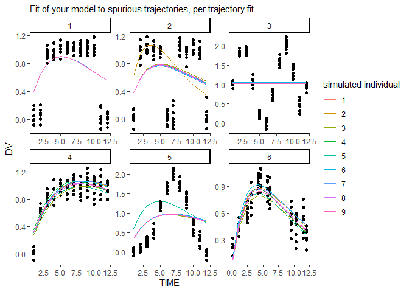<!-- -->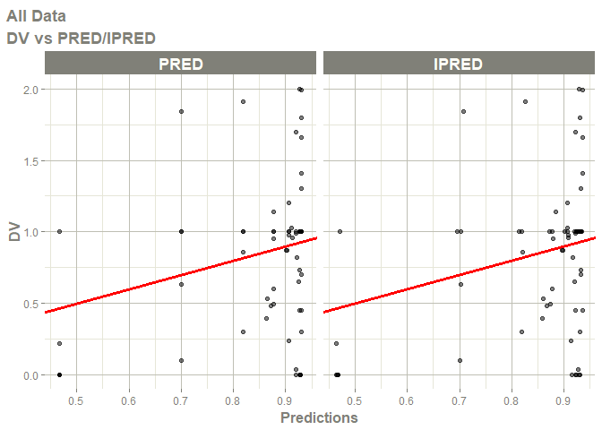<!-- -->

    ## Warning: Transformation introduced infinite values in continuous y-axis

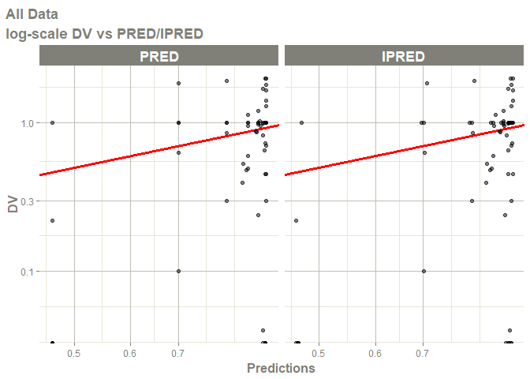<!-- --><!-- -->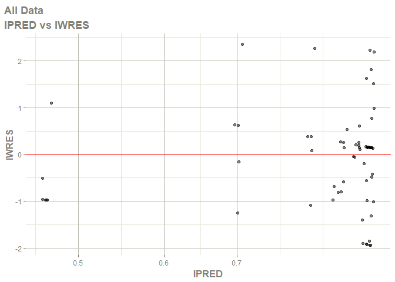<!-- -->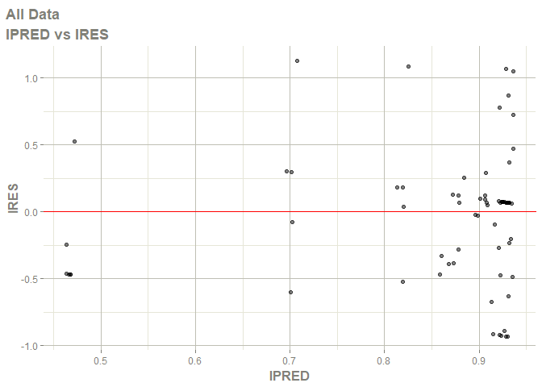<!-- -->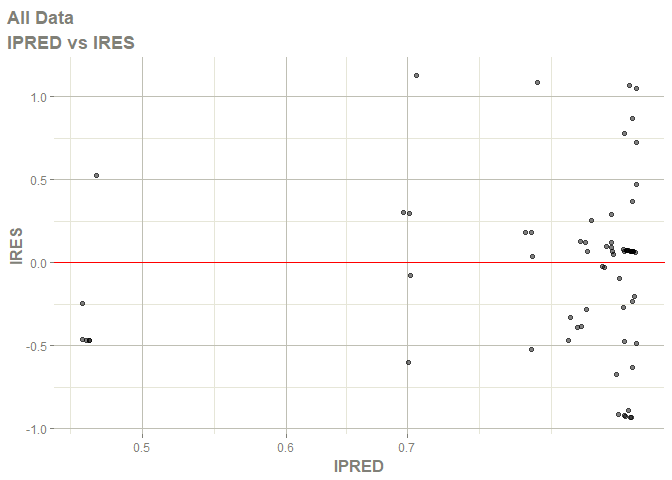<!-- -->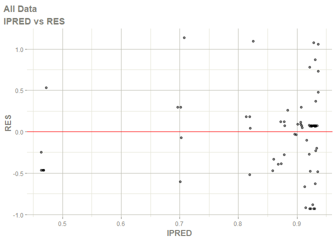<!-- -->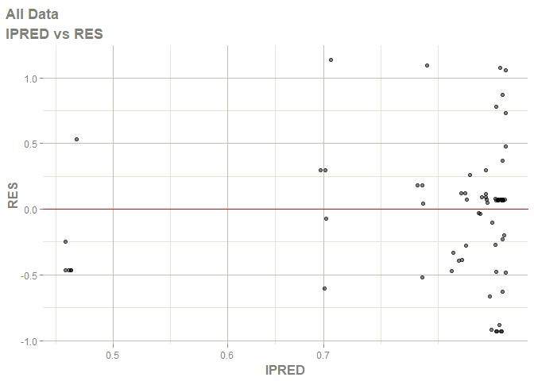<!-- -->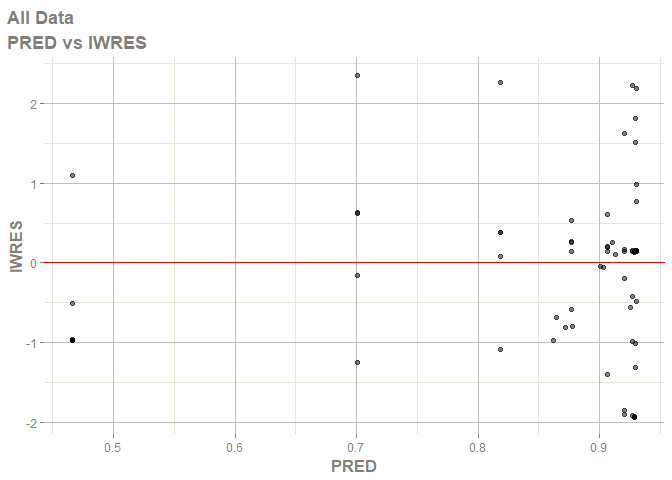<!-- -->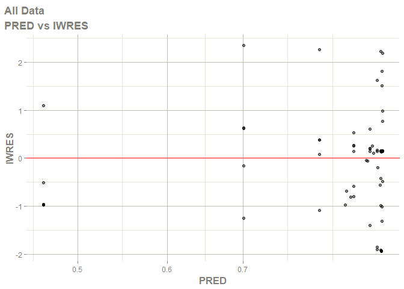<!-- -->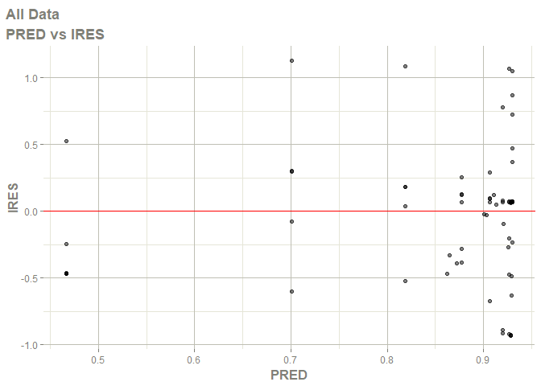<!-- -->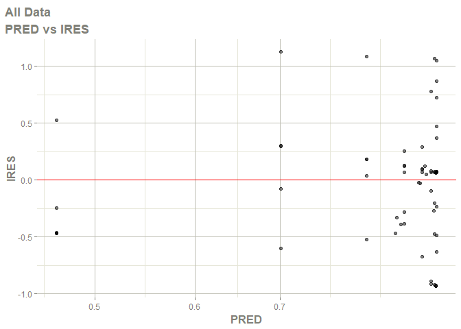<!-- -->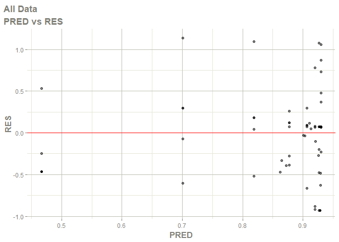<!-- -->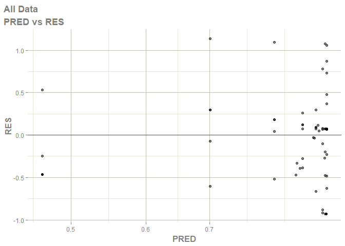<!-- -->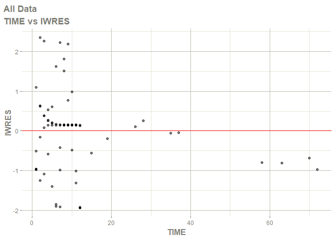<!-- -->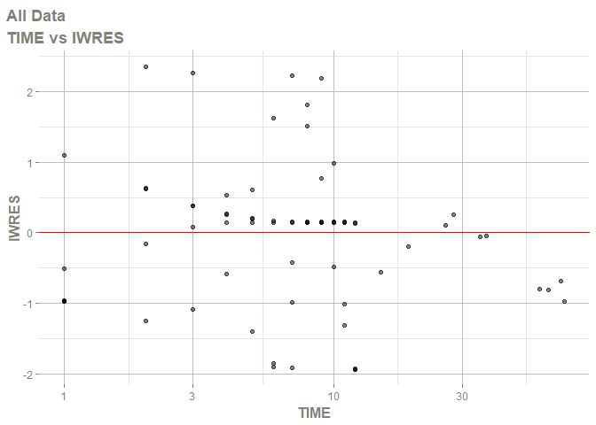<!-- -->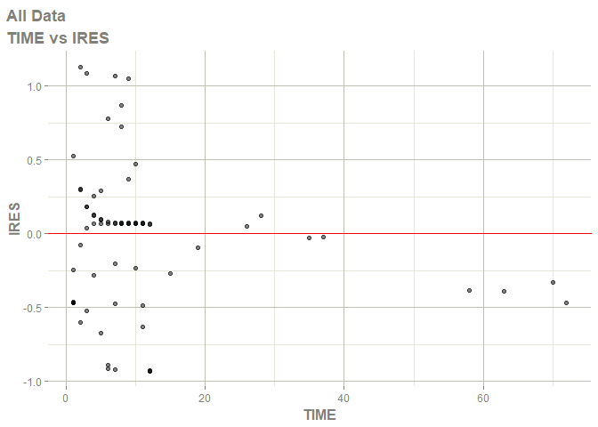<!-- -->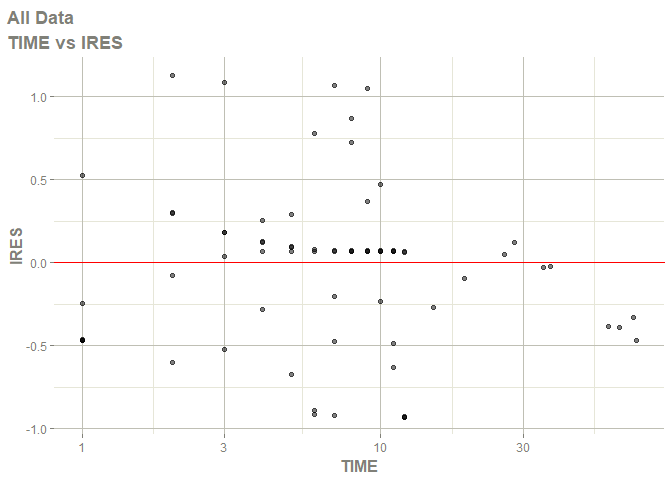<!-- --><!-- -->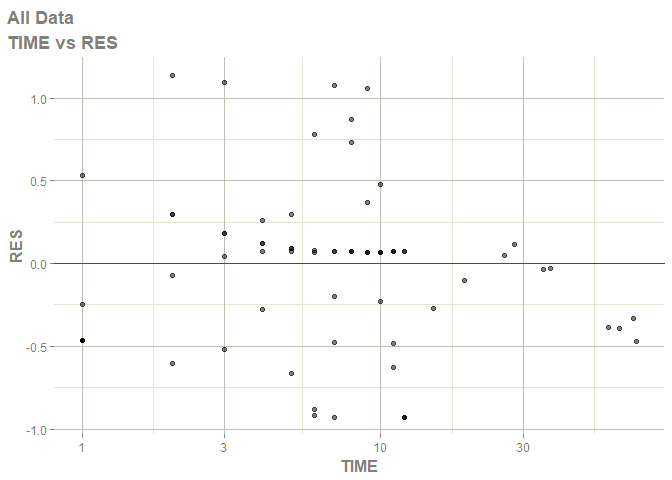<!-- -->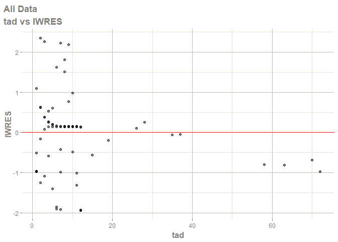<!-- -->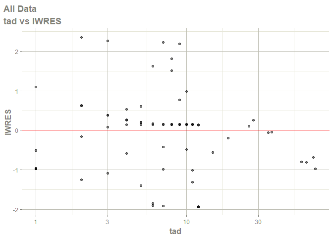<!-- -->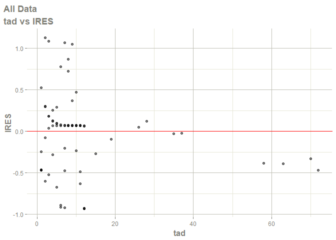<!-- -->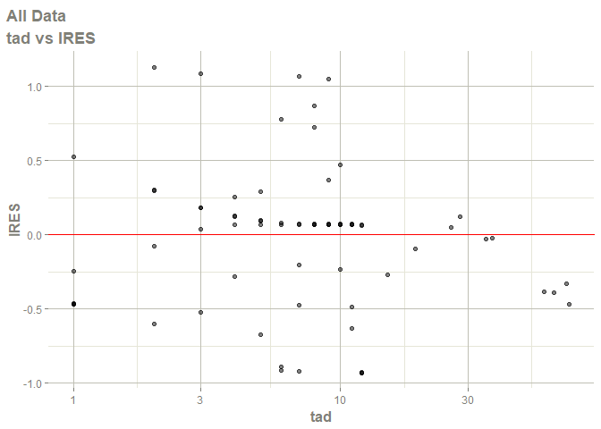<!-- -->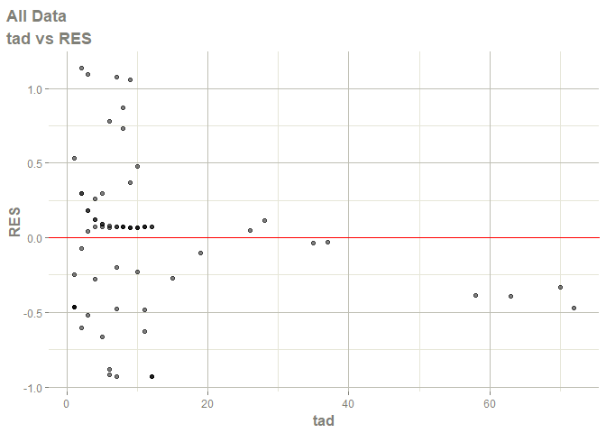<!-- -->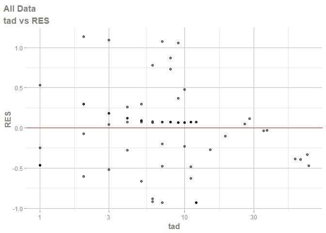<!-- -->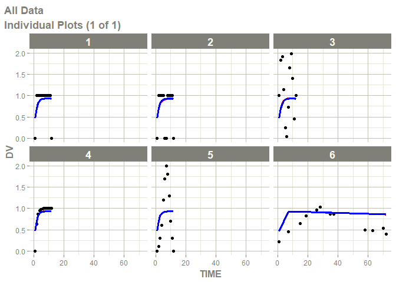<!-- -->
