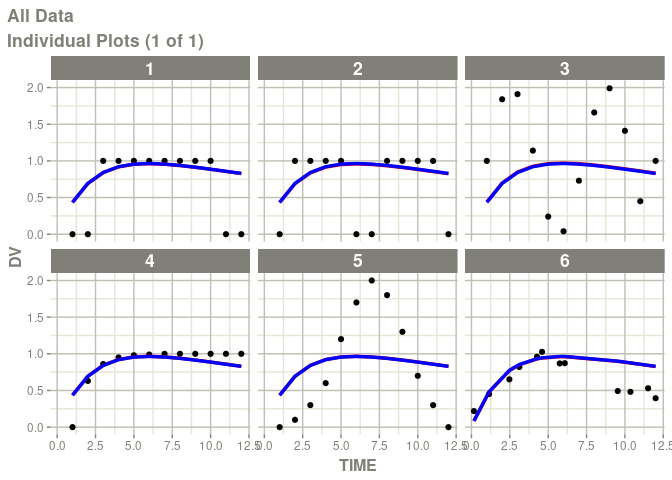
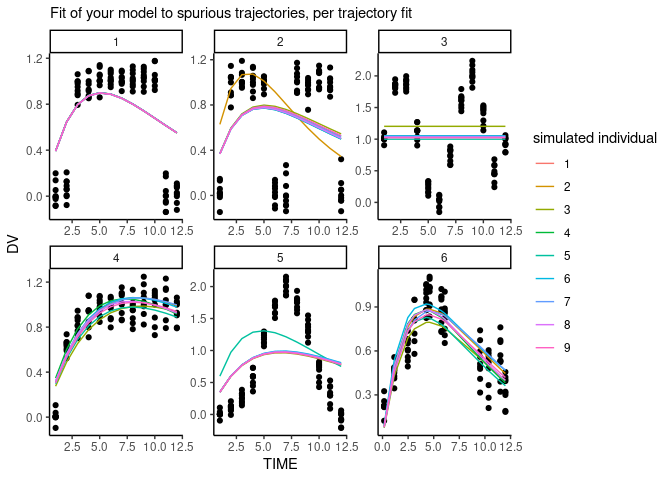
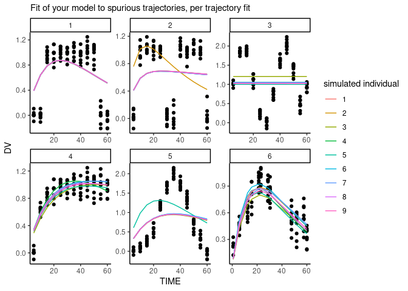
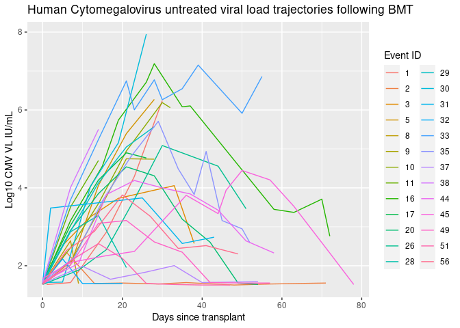

odejunkfitr
================
ojcharles
19/08/2022

This R package helps with two key problems in viral kinetic modelling.

1 - Asseses whether your ode model is over-parameterised and will fit
distributions spuriously.

2 - Fits several viral kinetic models to nlmicr formatted viral load
trajectory data, returning which is most parsimonious.

Viral kinetic models often must balance two ideas. It needs sufficient
mechanisms to accurately reflect the biology, but also as only one or
two compartments can be measured it needs to be sufficiently simple such
that key parameters are identifiable.

This package helps you understand with tangible outcomes where your
model lies on that spectrum. It will fit a model against spurious unique
trajectories, if your model can fit them well that could be a problem.
This also will fit your data against several previously published 2, 3
and 4 compartment models that prioritised brevity and identifieability
of parameters. Perhaps one of these is better suited.

install with:
`remotes::install_github("ojcharles/does_my_ode_model_fit_junk")`

``` r
library(ggplot2)
library(nlmixr2)
library(xpose)
library(plotly)
library(odejunkfitr)
odejunkfitr::load_examples() # loads data and models
```

    ## [1] ":)"

``` r
knitr::opts_chunk$set(
  collapse = TRUE,
  comment = "#>",
  fig.path = "man/figures/README-"
)
```

#### Define some viral load data, and a current model

### how well does my model fit spurious “junk”?

If the model is capable of fitting all of these trajectories, then you
should look in the mirror and contemplate.

#### At the population level

    #> [====|====|====|====|====|====|====|====|====|====] 0:00:00
    #> [[1]]

<!-- -->

#### When fitted individually

Here we simulate a variable populations around each trajectory then fit
in turn to a population of square waves, a population of sine waves etc.

``` r

all_fits = data.frame()
for(id in unique(data3_junk$ID)){ # for each type of test data
  
  # spoof a population
  t = data3_junk[data3_junk$ID == id,]
  df2 = t
  for(i in 1:8){
    t1 = t
    t1$ID = i + 1
    t1$DV = t1$DV + rnorm(length(t1$DV), 0, 0.1)
    df2 = rbind(df2,t1)
  }
  
  # get fit
  fit = nlmixr(my_model, df2, list(print=0), est="saem")
  fit$junk_id = id
  all_fits =  rbind(all_fits, fit)
}
  # plot
ggplot(all_fits) +
  geom_point(aes(x = TIME , y = DV)) +
  geom_line(aes(x = TIME, y = IPRED, colour = ID)) +
  theme_classic() +
  labs(subtitle = "Fit of your model to spurious trajectories, per trajectory fit",
       colour = "simulated individual") +
  facet_wrap(~junk_id, scales = "free")
```

<!-- -->

ahh but the dynamics I care about are much faster / shorter!  
Well then alter the junk data, they’re all nicely scaled :)

``` r
# rescale x axis to be 2 months
data3_junk$TIME = data3_junk$TIME * 5
all_fits = data.frame()
for(id in unique(data3_junk$ID)){ # for each type of test data
  
  # spoof a population
  t = data3_junk[data3_junk$ID == id,]
  df2 = t
  for(i in 1:8){
    t1 = t
    t1$ID = i + 1
    t1$DV = t1$DV + rnorm(length(t1$DV), 0, 0.1)
    df2 = rbind(df2,t1)
  }
  
  # get fit
  fit = nlmixr(my_model, df2, list(print=0), est="saem")
  fit$junk_id = id
  all_fits =  rbind(all_fits, fit)
}
  # plot
ggplot(all_fits) +
  geom_point(aes(x = TIME , y = DV)) +
  geom_line(aes(x = TIME, y = IPRED, colour = ID)) +
  theme_classic() +
  labs(subtitle = "Fit of your model to spurious trajectories, per trajectory fit",
       colour = "simulated individual") +
  facet_wrap(~junk_id, scales = "free") 
```

<!-- -->

``` r

data3_junk$TIME = data3_junk$TIME / 5  #rescale back
```

### Fitting multiple viral kinetic models to your data

From the above code you now have a handle for how maleable your model is
to various trajectories. If it has many compartment and many parameters
chances are it fitted more than 1 or 2 well.

The following chunks will outline an automated approach to finding the
most parsimonious model to fit your viral trajectories. It will retusn
information on the AIC (lower is better) as well as the RSE% of
estimates for population parameters (above 50% and parameters are
considered unidentifiable)

let’s plot the example viral load trajectories.

``` r
ggplot(my_data) +
  geom_line(aes(x = TIME, y = DV, colour = as.factor(ID))) +
  labs(title = "Human Cytomegalovirus untreated viral load trajectories following BMT", 
       colour = "Event ID", 
       y = "Log10 CMV VL IU/mL", 
       x = "Days since transplant") +
  theme_classic()
```

<!-- -->

#### Fit of example model to data

``` r
fit = nlmixr(my_model, my_data, list(print=0), est="saem")
#> Error : Error calculating covariance via linearization
#> Warning: covariance matrix non-positive definite, corrected by sqrtm(fim %*%
#> fim)
#> Warning: NAs introduced by coercion
fit$parFixedDf
#>          Estimate        SE     %RSE Back-transformed     CI Lower     CI Upper
#> tka    -13.925849 2.6414782 18.96817     8.955307e-07 5.054174e-09 1.586758e-04
#> tcl     -7.833681 1.4596268 18.63271     3.961646e-04 2.266935e-05 6.923286e-03
#> tv       2.727416 0.2838271 10.40645     1.529331e+01 8.768139e+00 2.667446e+01
#> add.sd   3.782617        NA       NA     3.782617e+00           NA           NA
#>            BSV(CV%) Shrink(SD)%
#> tka    3.367933e+14    96.62818
#> tcl    1.317557e+06    96.59663
#> tv     8.686423e+01    95.77574
#> add.sd           NA          NA
print(paste0("fit AIC is:", fit$AIC))
#> [1] "fit AIC is:864.814737594584"
```

#### Automated approach to model picking

The following function is quite compute intensive, pre-computed results
are shown in this notebook. - It will run through all the viral kinetic
models we ave encoded, currently 9. - Each model has a number of
flaviours, where we have fitted various parameters - There are currently
24 models - For each model, we attempt num_fit_attempts , attempts at
fitting with random initial pop parameters, and random model seed. - We
found this works well on a machine with at least 16 modern threads

``` r
# This function
df_many_models = odejunkfitr::fit_many_vk_models(vl_data = my_data,
                                                 num_fit_attempts = 5)
df_many_models
```

``` r
# precomputed AIC comparison
df_many_models = read.csv(system.file("all_vk_models_precomputed.csv", package = "odejunkfitr"))
df_many_models[,9:11] = round(df_many_models[,9:11], 1)
df_many_models
#>     model_name  arg1 arg2 arg3 arg4 arg5 shortname    AIC  X.RSE_mean
#> 1   m9_SMEIMCs  TRUE    1    1    1    1  TRUE1111 332.25         8.6
#> 2   m9_SMEIMCs FALSE    1    1    1    1 FALSE1111 314.76        11.0
#> 3   m8_SMEIMCs  TRUE    1    1    1    1  TRUE1111 324.45         8.8
#> 4   m8_SMEIMCs FALSE    1    1    1    1 FALSE1111 306.05       605.0
#> 5   m7_SMEIMCs FALSE    F    1    1    1 FALSEF111 415.09      4398.7
#> 6   m7_SMEIMCs  TRUE    F    1    1    1  TRUEF111 314.86       760.8
#> 7   m7_SMEIMCs FALSE    T    1    1    1 FALSET111 392.33     67239.1
#> 8   m7_SMEIMCs  TRUE    T    1    1    1  TRUET111 378.07     16356.3
#> 9  m6_EDICwTCL FALSE    F    F    F    1 FALSEFFF1 348.19        61.1
#> 10 m6_EDICwTCL FALSE    F    T    T    1 FALSEFTT1 381.24        25.6
#> 11 m6_EDICwTCL  TRUE    T    F    F    1  TRUETFF1 339.52        29.0
#> 12 m6_EDICwTCL  TRUE    T    T    T    1  TRUETTT1 328.14        23.5
#> 13 m5_EDICwTCL FALSE    F    1    1    1 FALSEF111 328.60       196.8
#> 14 m5_EDICwTCL FALSE    T    1    1    1 FALSET111 334.45       165.8
#> 15 m5_EDICwTCL  TRUE    F    1    1    1  TRUEF111 363.33      3210.1
#> 16 m5_EDICwTCL  TRUE    T    1    1    1  TRUET111 323.56        35.8
#> 17 m4_EDICwTCL FALSE    F    1    1    1 FALSEF111 503.15     21456.7
#> 18 m4_EDICwTCL FALSE    T    1    1    1 FALSET111 473.63     16706.6
#> 19 m4_EDICwTCL  TRUE    F    1    1    1  TRUEF111 463.15 377884498.5
#> 20 m4_EDICwTCL  TRUE    T    1    1    1  TRUET111 466.44     57369.2
#> 21 m3_EDICwTCL FALSE    F    F    1    1 FALSEFF11 346.96       926.8
#> 22 m3_EDICwTCL  TRUE    F    F    1    1  TRUEFF11 343.73     32163.0
#> 23 m3_EDICwTCL  TRUE    T    F    1    1  TRUETF11 317.26      3046.2
#> 24 m3_EDICwTCL  TRUE    T    T    1    1  TRUETT11 311.92      4802.3
#>       X.RSE_max     X.RSE_sd
#> 1          13.9          4.6
#> 2          18.7          5.2
#> 3          13.1          4.6
#> 4        2992.7       1334.8
#> 5       18714.6       7300.9
#> 6        3121.6       1348.8
#> 7      331245.1     147596.8
#> 8       46097.7      21815.1
#> 9         217.0         73.3
#> 10         46.2         15.0
#> 11        112.6         41.6
#> 12         70.3         31.2
#> 13        586.4        241.7
#> 14        849.3        308.1
#> 15      20667.0       7708.6
#> 16        105.1         38.9
#> 17     170626.8      56103.5
#> 18      93728.9      33331.3
#> 19 2855706391.6 1001907306.5
#> 20     216418.4      98323.2
#> 21       4050.7       1462.7
#> 22     238639.5      83521.0
#> 23      19238.0       7173.8
#> 24      24533.3       9809.3
```

In this example we can see that the models encoded within the
odejunkfitr package are more optimal by AIC and result in similarly low
maximum RSE% of parameters.

Now you have assessed: - How well your model fits spurious trajectories,
hopefully not too well. - Whether simple 2,3,4 compartment models are
able to reproduce the complex dynamics in your viral load data.

Hopefully this starts you off on a good footing for further model
exploration! :)
